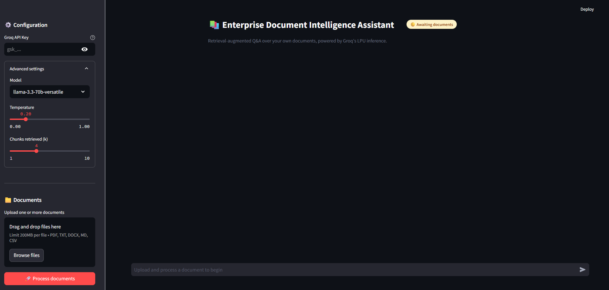
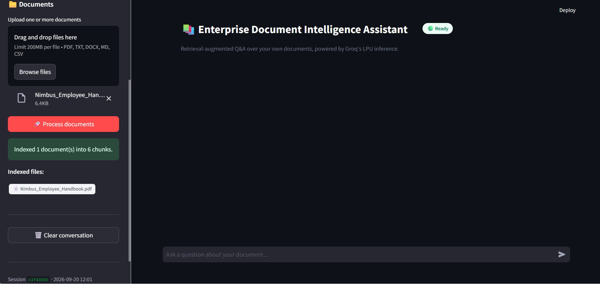
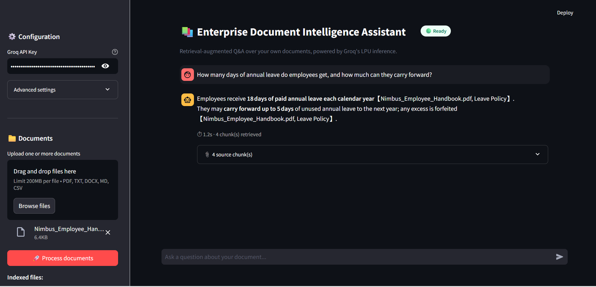

# DocSense


[](LICENSE)

DocSense is a Streamlit app for retrieval-augmented question answering over your own documents. Upload files, index them into a vector store, and chat with them. Answers come from the retrieved passages, and each response shows the source chunks it used.

---

## Screenshots

**App preview**



**Groq API key and file upload**


**Indexed documents**



**Question answering with source chunks**



## Features

- Upload and index multiple documents in one session
- Retrieval-augmented answers using LangChain and a FAISS vector store
- LLM inference through Groq (`openai/gpt-oss-120b` or `openai/gpt-oss-20b`)
- Source chunks shown under each answer, with response time
- Adjustable model, temperature and number of retrieved chunks (k) in the sidebar
- Conversation history is passed to the chain, so follow-up questions work
- Docker support with a non-root user and a health check

## Tech Stack

| Area | Tools |
|---|---|
| UI | Streamlit |
| Orchestration | LangChain |
| LLM provider | Groq (`langchain-groq`) |
| Vector store | FAISS (`faiss-cpu`) |
| Embeddings | `sentence-transformers` via `langchain-huggingface` |
| Document loading | `pypdf`, `docx2txt` |
| Configuration | `pydantic`, `pydantic-settings`, `python-dotenv` |

## Project Structure

```
.
├── app.py                  # Streamlit entry point
├── src/                    # Config, document processing, vector store, RAG chain
├── tests/                  # Tests
├── data/                   # Local data and vector store
├── Screenshots/            # App screenshots
├── .github/workflows/      # CI workflows
├── Dockerfile
├── docker-compose.yml
├── pyproject.toml
├── requirements.txt
└── requirements-dev.txt
```

## Getting Started

### Prerequisites

- Python 3.11
- A Groq API key (free at [console.groq.com](https://console.groq.com))

### Installation

```bash
git clone https://github.com/Chowdri-Furkhan07/docsense-rag.git
cd docsense-rag
python -m venv venv
source venv/bin/activate      # Windows: venv\Scripts\activate
pip install -r requirements.txt
```

### Run

```bash
streamlit run app.py
```

Open http://localhost:8501.

## Usage

1. Enter your Groq API key in the sidebar.
2. Upload one or more documents.
3. Click **Process documents** to chunk and embed them.
4. Ask questions in the chat box and expand **source chunks** to see where each answer came from.

Use **Clear conversation** to reset the chat. Processing new documents also resets it.

## Docker

```bash
docker build -t docsense-rag .
docker run -p 8501:8501 docsense-rag
```

The app is served on port 8501, and the container health check uses Streamlit's `/_stcore/health` endpoint.

## Notes

- Groq model availability changes over time. If you get a `model_not_found` error, check the [current model list](https://console.groq.com/docs/models) for your plan.
- The embedding model downloads on first run, so the first document processing can take longer.

## License

Released under the [MIT License](LICENSE).

## Author

**Chowdri Furkhan**
B.E. in Artificial Intelligence and Machine Learning

- GitHub: [@Chowdri-Furkhan07](https://github.com/Chowdri-Furkhan07)
